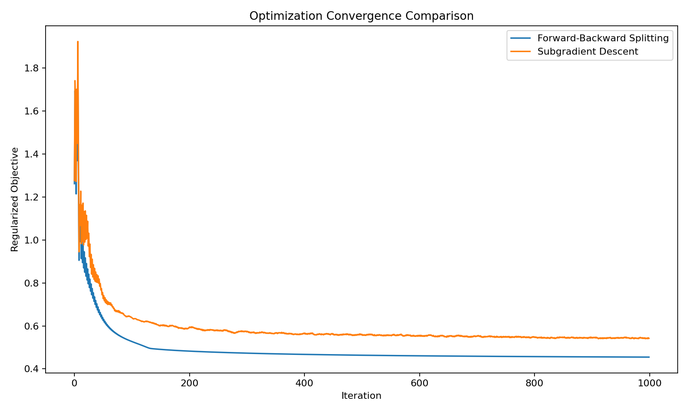
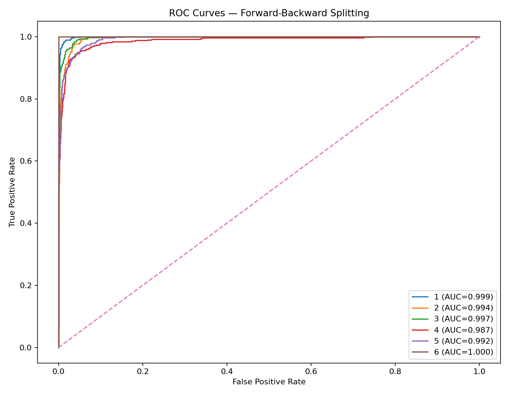
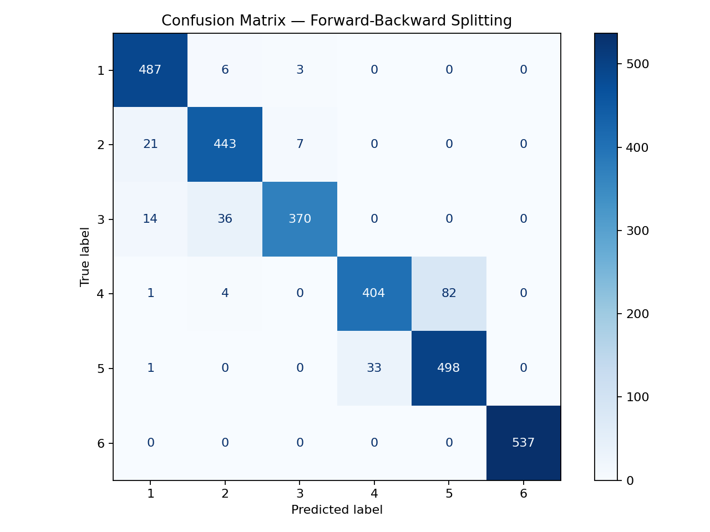
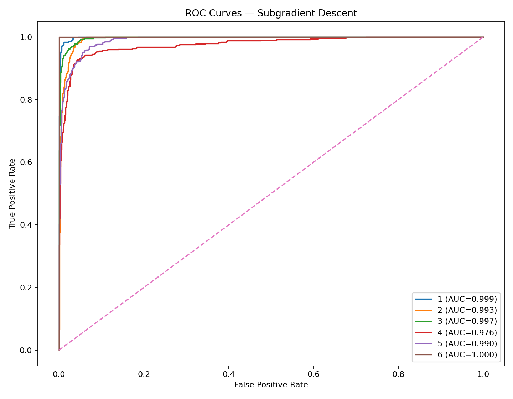

# Sparse Multiclass Classification in High-Dimensional Data

**Comparing Forward-Backward Splitting and Subgradient Descent for L1-Regularized Multiclass Logistic Regression**

This project investigates sparse multiclass classification in a high-dimensional setting by implementing and comparing two optimization strategies from scratch:

- **Forward-Backward Splitting (FBS)** / proximal-gradient optimization
- **Subgradient Descent**

The project originated as a single research script and has been refactored into a reproducible, portfolio-ready Python project.

## Dataset Summary

The supplied data contain:

- **7,352** original training observations
- **2,947** test observations
- **561** predictor variables
- **6** encoded outcome classes
- **5,916** training observations after reproducible class balancing

The training data are downsampled to the size of the minority class before model fitting. Feature standardization is fitted on the balanced training set and then applied to the test set.

## Why This Project Is Interesting

High-dimensional classification creates both statistical and computational challenges. This project uses an **L1-regularized multinomial logistic model** to encourage sparse coefficient estimates and compares two ways of optimizing its non-smooth objective.

Unlike a project that simply calls a prebuilt classifier, the core optimization routines here are implemented directly with NumPy.

## Methods

### Multiclass Logistic Model

For class \(k\), the model uses the softmax transformation

\[
P(Y_i=k\mid x_i)
=
\frac{\exp(x_i^\top \beta_k)}
{\sum_{j=1}^K \exp(x_i^\top \beta_j)}.
\]

The objective combines multinomial cross-entropy with an L1 penalty:

\[
\mathcal{J}(\beta)
=
-\frac{1}{n}
\sum_{i=1}^n
\sum_{k=1}^K
y_{ik}\log p_{ik}
+
\lambda\|\beta\|_1.
\]

The intercept is excluded from penalization.

### Forward-Backward Splitting

FBS separates the differentiable logistic loss from the non-differentiable L1 term. Each iteration uses:

1. a gradient step on the smooth multinomial loss;
2. a proximal soft-thresholding step for the L1 penalty.

### Subgradient Descent

Subgradient descent optimizes the regularized objective directly by combining the gradient of the logistic loss with a subgradient of the L1 penalty.

## Actual Results

The following results were generated from the supplied train/test datasets using the original project's parameter choices \(\lambda=0.01\) and learning rate \(0.1\).

| Metric | Forward-Backward Splitting | Subgradient Descent |
|---|---:|---:|
| Accuracy | **92.94%** | 87.82% |
| Macro F1 | **92.82%** | 87.17% |
| Macro ROC-AUC (OvR) | **0.9949** | 0.9924 |
| Mean sensitivity | **92.70%** | 87.28% |
| Mean specificity | **98.58%** | 97.54% |
| Nonzero coefficients | **189 / 3,366** | 3,366 / 3,366 |
| Zero coefficients | **94.39%** | 0.00% |
| Runtime in this run | 12.11 s | 11.63 s |
| Iterations | 1,000 | 1,000 |

## Visual Results

### Optimization Convergence



### Forward-Backward Splitting ROC Curves



### FBS Confusion Matrix



### Subgradient Descent ROC Curves



### Main Finding

FBS achieved substantially better classification performance while producing a highly sparse solution: only **189 of 3,366 penalized coefficients remained nonzero**, corresponding to about **94.4% zeros**.

The constant-step subgradient implementation produced no coefficients exactly equal to zero, which illustrates an important practical advantage of the proximal soft-thresholding step when exact sparsity is desired.

### Convergence Note

Both methods reached the configured 1,000-iteration cap in this run. FBS was close to the stopping tolerance, while the constant-step subgradient method still showed larger objective changes. Therefore, the runtime values above should be interpreted as runtime under a common iteration budget rather than proof that either method converged faster.

## Evaluation Outputs

Running the project generates:

- `results/model_comparison.csv`
- `results/convergence_comparison.png`
- `results/roc_fbs.png`
- `results/roc_subgradient.png`
- `results/confusion_matrix_fbs.png`
- `results/confusion_matrix_subgradient.png`

## Repository Structure

```text
high-dimensional-sparse-classification/
├── README.md
├── requirements.txt
├── LICENSE
├── .gitignore
├── data/
│   └── README.md
├── notebooks/
│   └── README.md
├── results/
│   ├── model_comparison.csv
│   ├── convergence_comparison.png
│   ├── roc_fbs.png
│   ├── roc_subgradient.png
│   ├── confusion_matrix_fbs.png
│   └── confusion_matrix_subgradient.png
├── src/
│   ├── __init__.py
│   ├── preprocessing.py
│   ├── optimization.py
│   ├── evaluation.py
│   └── train.py
└── tests/
    └── test_optimization.py
```

## Installation

```bash
pip install -r requirements.txt
```

## Data

Place the two CSV files in `data/` as:

```text
data/train.csv
data/test.csv
```

Each must contain a target column named `label`.

The raw CSV files are **not included in the GitHub-ready package by default** because their publication source/license should be documented before redistribution.

## Running the Analysis

From the repository root:

```bash
python -m src.train
```

This reproduces the comparison using the original project's selected values:

- `lambda = 0.01`
- `learning_rate = 0.1`

Optional FBS cross-validation is available with:

```bash
python -m src.train --tune
```

The tuning option evaluates a small parameter grid using stratified cross-validation before fitting the final FBS model.


## Reproducibility

Random seeds are fixed for class balancing and cross-validation. Preprocessing transformations are learned only from the training data.

## Author

Dr. Emil Agbemade
